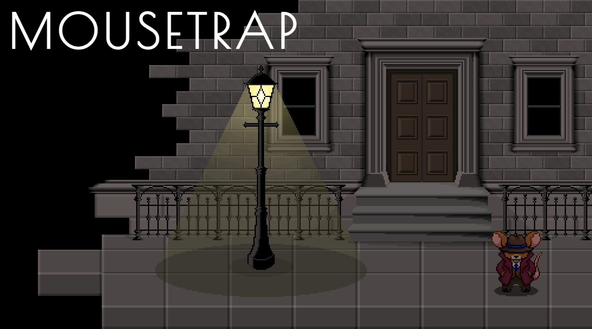

## 
Hello there! Christine typing 👩‍💻

  

 

Self-taught full-stack developer with a background in mathematics and budding penchant for front-end game development. A former teacher, software development had me at 'Hello World!', allowing me to marry my proclivity for puzzles and problem solving with a deep-seated love for devising engaging, accessible user experiences. I relished the opportunity to create compelling materials to help my students take ownership of their learning, and now channel this energy into building intuitive, user-centred software (gamifying features wherever possible, and appropriate, of course 😉).

 

## 
Recent Projects 

  
  
  
  

 

## Bonus Factoids

- 🔭 I’m currently working on a digital version of the classic tabletop game Rummikub, with a twist 😏 
- 🌱 On my TOLEARN list: Python, GDScript (Godot's built-in scripting language), Blender, MongoDB and Mongoose among others, many others. The limit does not exist! 
- 👯 I’m looking to collaborate on 2D RPG projects of any and every variety 😁 
- 💬 Ask me about HTML Canvas, my favourite HTML5 feature! 
- 📫 You can reach me via <a href="https://www.linkedin.com/in/christine-lush-97300b2b6/">LinkedIn</a> or good ol' fashioned email at christinelush@hotmail.co.uk 
- 😄 Pronouns: she/her 
- ⚡ Fun fact: i-recently-learned-that-this-variable-naming-convention-is-referred-to-as-kebab-case 😅 A revelation! Now petitioning for all variable naming conventions to be renamed after foodstuffs.
